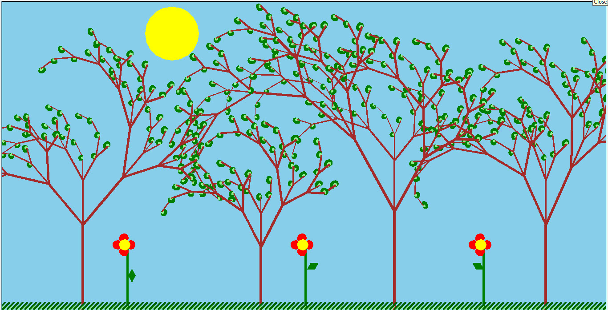

I drew this with python. It's not that good but my friend made an artwork from this project!



``` python
import turtle
import random

    
turtle.bgcolor("skyblue")
t=turtle.Turtle()
t.penup()
t.setpos(-300,280)
t.shape("circle")
t.color("yellow")
t.shapesize(6)
t.pendown()

def tree(l,s):
    a=random.randint(20,40)
    if l > 30:
        turtle.color("brown")
        turtle.pensize(s)
        turtle.forward(l)
        tree(l*0.5,s-2)
        turtle.left(a)
        tree(l*0.8, s-0.5)
        turtle.right(2*a)
        tree(l*0.6,s-0.1)
        turtle.left(a)
        turtle.backward(l)
    elif l<= 30 :
        turtle.color("green")
        turtle.begin_fill()
        turtle.circle(5)
        turtle.end_fill()
        turtle.color("brown")
        turtle.begin_fill()
        turtle.color("light green")
        turtle.circle(2)
        turtle.end_fill()
        turtle.color("brown")

def tree2(l,s):
    a=random.randint(20,40)
    if l > 30:
        turtle.color("brown")
        turtle.pensize(s)
        turtle.forward(l)
        tree(l*0.5,s-2)
        turtle.left(a)
        tree(l*0.6, s-1)
        turtle.right(2*a)
        tree(l*0.7,s-0.5)
        turtle.left(a)
        turtle.backward(l)
    elif l<= 30 :
        turtle.color("green")
        turtle.begin_fill()
        turtle.circle(5)
        turtle.end_fill()
        turtle.color("brown")
        turtle.begin_fill()
        turtle.color("light green")
        turtle.circle(2)
        turtle.end_fill()
        turtle.color("brown") 

def go(l):
    if l<20:
        turtle.forward(l)
    else:
        turtle.begin_fill()
        go(l/3)
        turtle.left(60)  
        go(l/3)
        turtle.left(120)
        go(l/3)
        turtle.left(60)
        go(l/3)
        turtle.color("green")
        turtle.end_fill()

turtle.penup()
turtle.pencolor("green")
turtle.setpos(4,-250)
turtle.pendown()
go(50)

def go2(l):
    if l<20:
        turtle.forward(l)
    else:
        turtle.begin_fill()
        go2(l/3)
        turtle.left(60)  
        go2(l/3)
        turtle.left(120)
        go2(l/3)
        turtle.left(60)
        go2(l/3)
        turtle.color("green")
        turtle.end_fill()

turtle.penup()
turtle.setpos(-390,-250)
turtle.pendown()
go2(50)

def go3(l):
    if l<20:
        turtle.forward(l)
    else:
        turtle.begin_fill()
        go3(l/3)
        turtle.left(60)  
        go3(l/3)
        turtle.left(120)
        go3(l/3)
        turtle.left(60)
        go3(l/3)
        turtle.color("green")
        turtle.end_fill()

turtle.penup()
turtle.setpos(400,-250)
turtle.pendown()
go3(50)

   
turtle.penup()
turtle.setheading(90)
turtle.speed(0)
turtle.setpos(540,-350)
turtle.pendown()
turtle.tracer(0)
tree2(200,6)
turtle.update() 


turtle.penup()
turtle.setheading(90)
turtle.speed(0)
turtle.setpos(200,-350)
turtle.pendown()
turtle.tracer(0)
tree(230,6)
turtle.update()

turtle.penup()
turtle.setheading(90)
turtle.speed(0)
turtle.setpos(-100,-350)
turtle.pendown()
turtle.tracer(0)
tree2(150,6)
turtle.update()

turtle.penup()
turtle.setheading(90)
turtle.speed(0)
turtle.setpos(-500,-350)
turtle.pendown()
turtle.tracer(0)
tree2(200,6)
turtle.update() 


def circle1(x,y):
    turtle.penup()
    turtle.setpos(x, y)
    turtle.pendown()
    turtle.color("yellow")
    turtle.begin_fill()
    turtle.circle(10)   
    turtle.end_fill()

def circle2(x,y):
    turtle.penup()
    turtle.setpos(x, y)
    turtle.pendown()
    turtle.color("red")
    turtle.begin_fill()
    turtle.circle(8)   
    turtle.end_fill()  

def draw_line(x1,y1,x2,y2) :
    turtle.penup()
    turtle.setpos(x1,y1)
    turtle.pencolor("green")
    turtle.pensize(5)
    turtle.pendown()
    turtle.setpos(x2,y2)


draw_line(0,-195,0,-800)
circle2(0,-180)
circle2(0,-210)
circle2(-15,-195)
circle2(15,-195)
circle1(3.5,-195)

draw_line(-400,-195,-400,-800)
circle2(-400,-180)
circle2(-400,-210)
circle2(-415,-195)
circle2(-385,-195)
circle1(-396.5,-195)

draw_line(400,-195,400,-800)
circle2(400,-180)
circle2(400,-210)
circle2(385,-195)
circle2(415,-195)
circle1(403.5,-195)

def chaman1():
 for x in range(-700,700,10):    
    y=5*(x-int(x))-343
    turtle.penup()
    turtle.pencolor("light green")
    turtle.pensize(4)
    turtle.setpos(x,y)
    turtle.pendown()
    turtle.setpos(x+10,y+10)
chaman1()    

def chaman2():
 for x in range(-700,700,10):    
    y=5*(x-int(x))-340
    turtle.penup()
    turtle.pencolor("dark green")
    turtle.pensize(4)
    turtle.setpos(x,y)
    turtle.pendown()
    turtle.setpos(x+15,y+15)
chaman2()    


turtle.mainloop()
` ` `